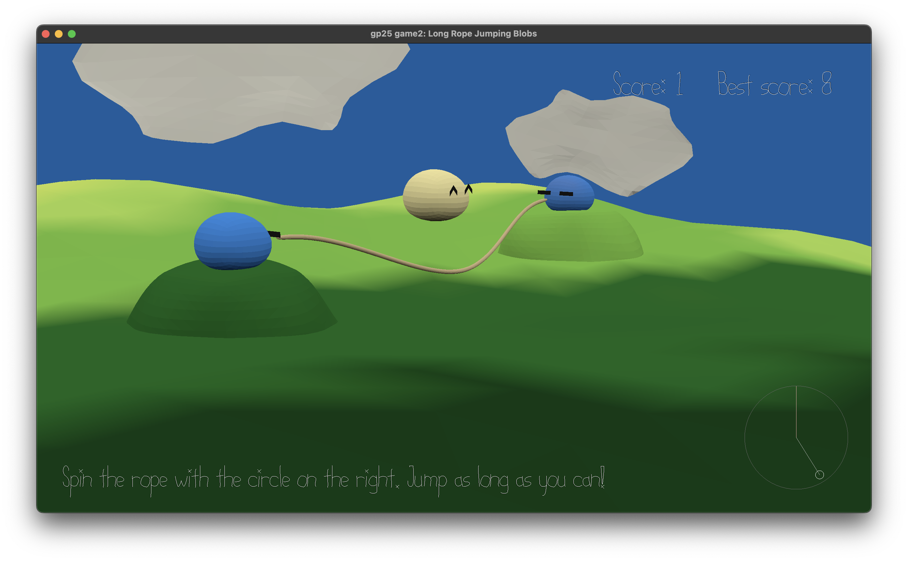

# Long Rope Jumping Blobs

Author: Cheyu Tu

Design: Three blobs are playing long rope jumping. Player's job is to help the blobs to spin the rope without hitting the jumping blob.

Screen Shot:

How To Play:

There's a joystick-like panel on the bottom right. Click and drag in the panel to spin the rope.

Goal:

Let the jumper blob successfully jump without hitting the rope for as long as possible.

Credit:
Color reference (I mostly picked the colors from this image): https://lospec.com/gallery/tozzo/a-place-far-away 

The scene file is scenes/rope_scene.blend

This game was built with [NEST](NEST.md).
